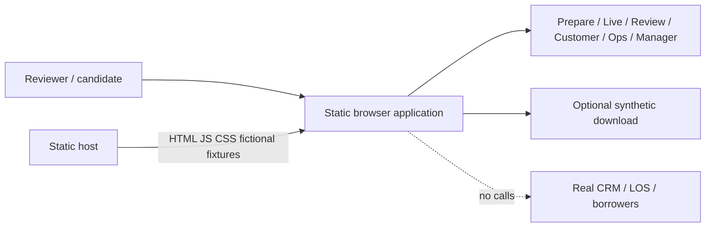
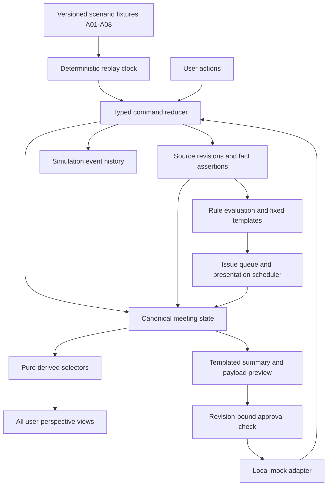
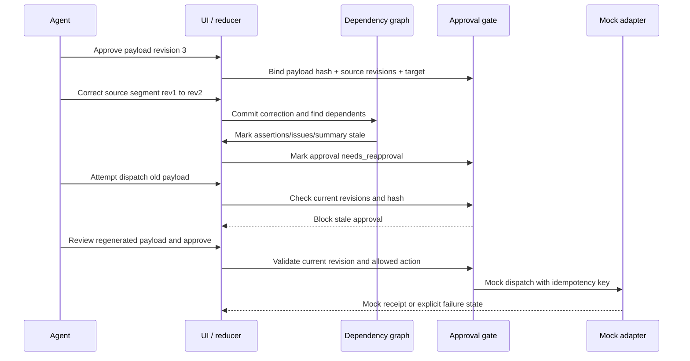
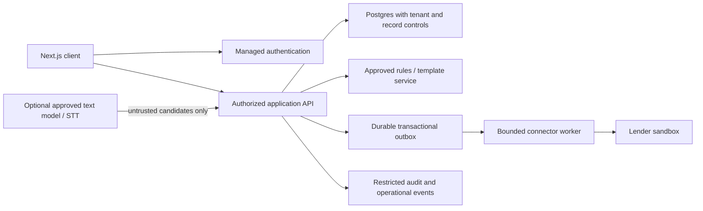

# Darwix Build Pack 05 — Architecture and Technical Design

Demo and future-pilot architectures, diagrams, module boundaries, state ownership, correction propagation, approval gates, and failure recovery.

## Architecture decision and boundaries

Status: proposed architecture, not deployed. Baseline is a Next.js (React / TypeScript) application with bundled fictional fixtures, deterministic rules, memory-only shared state, and local mock adapters. No runtime backend, database, microphone, speech provider, LLM, third-party analytics, or API credential.

This is a functional interactive prototype: users change state, resolve conflicts, approve a version, and observe consequences. It is not an AI-quality demonstration. Scripting the simulation is allowed by the assignment; pretending the fixture engine understands arbitrary speech is not.

Use one state store for agent, customer preview, manager, and operations views. A role selector changes perspective only; it does not enforce permissions. All shipped fixtures and demonstration policies are public-inspectable. No actual customer or confidential lender data belong in the build.

Requirements R01–R16 and scenarios A01–A08 are canonical in the PRD/UX specifications. Additional research scenario ideas must not replace these eight mandatory cases.

## Context and component diagrams

### Demo context


### Internal components


Diagrams describe the intended build, not running infrastructure. State transitions are deterministic; asynchronous mock outcomes return commands to the reducer. Components do not maintain separate copies of borrower truth.

## Module and state ownership

```text
src/
  domain/       types, invariants, revisions, payload canonicalization
  fixtures/     CASE-001/002, A01-A08, controls, demo policy templates
  simulation/   deterministic clock, replay, variant scheduler
  rules/        trigger guards, fixed messages, prioritization, dedupe
  state/        initial state, reducer, commands, selectors
  adapters/     port interfaces, mock CRM/LOS, mock receipts
  views/        prepare, live, review, customer, operations, manager, lab
  components/   evidence drawer, fact card, issue card, task table
  telemetry/    in-memory event schemas and derived demo metrics
  tests/        unit fixtures and browser acceptance tests
```

**Canonical state:** meeting, borrowers, immutable source revisions, assertions, conflicts, issues, summary revisions, approvals, tasks, outbox items, mock remote receipts and event sequence. Selectors calculate readiness and dashboard counts; never hardcode success numbers.

**Determinism:** fixed seed/case version; monotonically increasing event sequence; relative demo clock; stable IDs; injected clock for tests. Pause/step/replay are not tied to unpredictable remote requests. Reset increments a run generation and cancels pending timers; stale async callbacks from an earlier run are ignored.

**Persistence:** memory-only baseline. Navigation keeps state; reload resets with an explicit notice. A future synthetic-only sessionStorage option needs schema versioning and reset tests. Browser storage is not a trusted audit log or security boundary.

**Rule input:** finalized fixture events, current revisions and structured fields. Low-quality/interim segments create clarification candidates. A scenario marker is not evidence of real natural-language classification. User corrections explicitly edit typed fields and source text; no implied inference for arbitrary text.

**Scheduler:** default one primary and two secondary cards; ordinary 30-second cooldown; dedupe by rule + subject + issue basis. High-risk unresolved items remain in review queue even if their visual card is dismissed. Policy defaults are proposed UX choices to test, not universal thresholds.


**Baseline correction input:** selecting a correction applies a pre-authored synthetic source revision and enumerated reason; no unrestricted text box, upload, arbitrary URL or real-data entry. “Edit source text” in this design means apply one of those preset fictional revisions. A future free-text variant is separate scope, needs explicit untrusted-input/content review, and cannot be described as preventing sensitive input.

**Clock split:** simulationTimeMs drives replay; a separate monotonic observedElapsedMs/research stopwatch measures actual role-play task time. Operations AcceptHandoff/ReturnHandoff are explicit commands; approve/export/mock-receipt never imply reviewer acceptance. The mode-specific gate in document 07 applies to both ready and review_needed dispatches.

## Critical sequence — correction and approval



Maintain reverse dependency edges from source revisions to assertions, issues, summaries and proposed actions. A correction creates a new source revision; it does not mutate the old record. Invalidation completes in the same reducer transition before another dispatch command is accepted. A conservative initial implementation may invalidate the whole meeting summary/approval for any material fact change; optimize to finer dependency scopes later.

Payload approval binds action type, target record, field values, fact/source revisions, rule/template versions and payload hash. Editing anything material invalidates approval. Hashes demonstrate consistency, not resistance to a user tampering with a static app.

If a mock action is already delivered, correction creates a reconciliation task. Never rewrite history to suggest a remote operation was undone. If dispatch is in flight, mark supersession requested and reconcile the outcome; do not assume cancellation succeeded.

## Failure handling and future pilot

| Failure | Intended behavior |
|---|---|
| Missing or stale source | Mark unsupported/stale; do not approve as a current fact |
| Ambiguous speaker or value | Preserve unassigned/unknown; request clarification |
| Repeated nudge | Update existing issue and repeat count, preserve evidence |
| Missing next step | Block normal-ready close, allow draft or documented declined-follow-up |
| Connector unavailable before dispatch | Preserve approved version; failed/unavailable state and controlled manual export |
| Timeout after possible remote commit | delivery_unknown; reconcile by idempotency key before another send |
| Correction after delivery | Add correction task, preserve original receipt |
| Double click | Same action/idempotency key; one logical result |
| Reset during pending callback | Ignore old run-generation response |
| Asset/network failure | Clear error and local built-preview fallback; no dependency on runtime AI |

### Future authenticated pilot — not the demo


Proposed incremental path: retain frontend/domain logic; add Supabase Auth/Postgres with RLS and least-privilege grants; leverage Next.js Route Handlers / server boundary for approvals, privileged writes, and provider secrets.

Server must validate membership, record authorization, request schema, evidence freshness, expected version and approved payload atomically. Persist approval/event/outbox enqueue in one database transaction. Connector delivery is not “exactly once”; use idempotency plus reconciliation. Tenant-scoped credentials, restricted logs, retention/deletion, real audit controls and incident ownership are additional work.

Sources: [Next.js documentation](https://nextjs.org/docs), [React architecture](https://react.dev/learn), [Supabase RLS](https://supabase.com/docs/guides/database/postgres/row-level-security), [OWASP authorization](https://cheatsheetseries.owasp.org/cheatsheets/Authorization_Cheat_Sheet.html). The architecture is an authored recommendation, not a claim these frameworks automatically supply the proposed controls.
